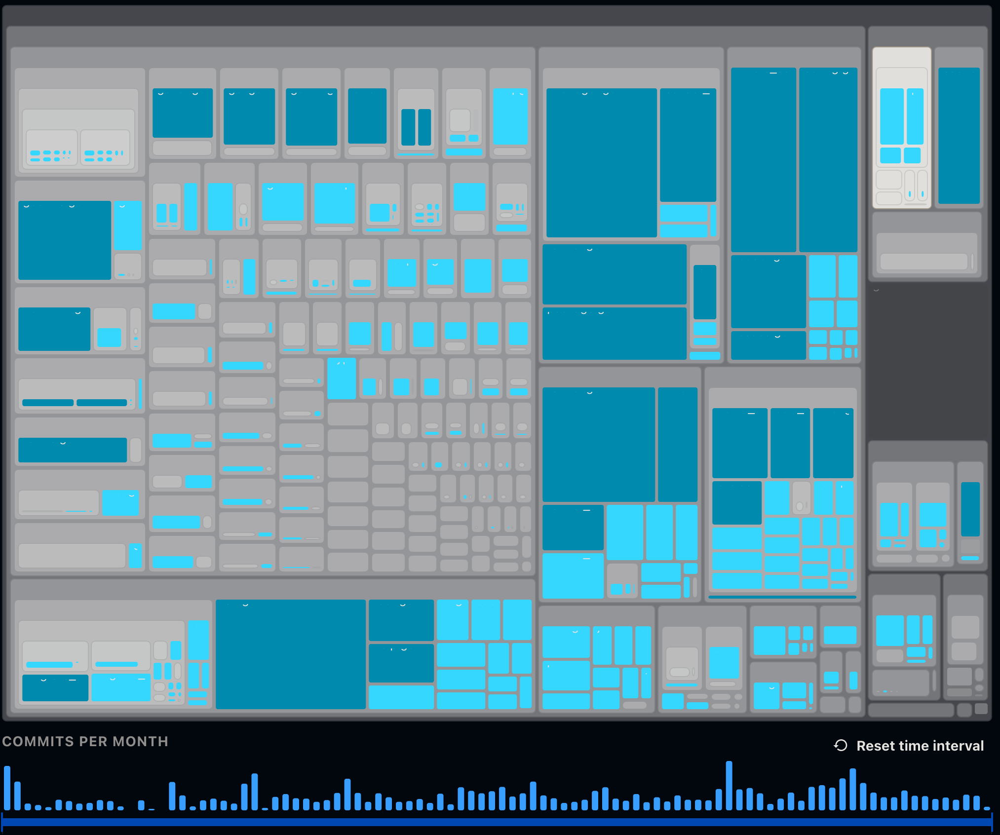
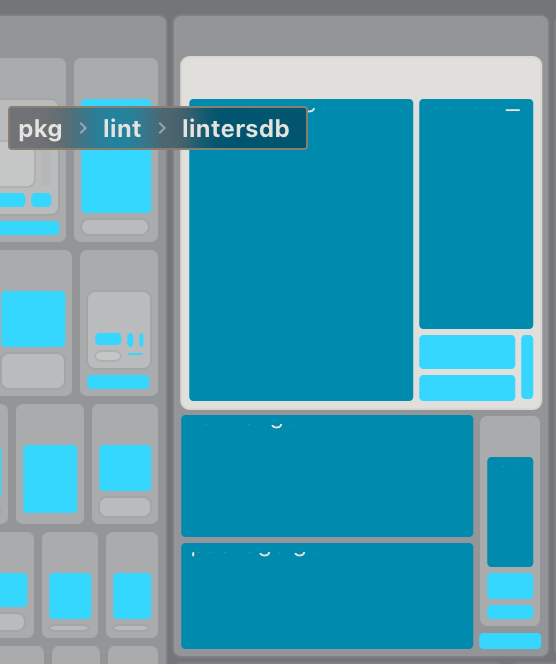

# Here is a small gittruck line count analysis

The images show which parts of the system have the most line changes which shows what parts were worked on the most in terms in line count at least. Its important to note that some of this could be boilerplate generation in particular the db part of the linter could be somewhat machine generated depending on if they are using an ORM. Whilst this doesn't give us a whole lot of insight its a good first step to understand if any parts of the system 

All of these were done with the line change for size and filetype for color

Another fun metric that can be gathered is when the last changes were done to a file based on lines changed. The colors bugged out and i couldn't really get them to work but by hovering over most of the modules its clear that nothing has really happened in the processors package in around a year. So either this module is basically done or maybe this could be a sign of neglect, (it's hard to say without having access to any maintainers of the system).

# Actually looking at truck factor

Whilst this metric is more useful for insight in the project at a socio-techincal \ref{mircea} angle. Its clear that some parts are properly maintained by multiple authors but certain parts have a 93% contribution of certain authors. This of course makes those parts less resiliant if say this Ludovic guy ever decides to leave the project. An excelent example of how dangerous truck factor can be can be found in this great blog post by Christian Hergert who previously worked at Red-Hat as a project maintainer. Now 15+ larger gnome projects are in jeaporady and have been without a maintainer since sometime mid of March \ref{https://blogs.gnome.org/chergert/2026/02/06/mid-life-transitions/}. With how widespread the use of Red-Hat Fedora is in the industry, this could pose a severe risk for the corporate world. This is a good example of why truck factor matters.